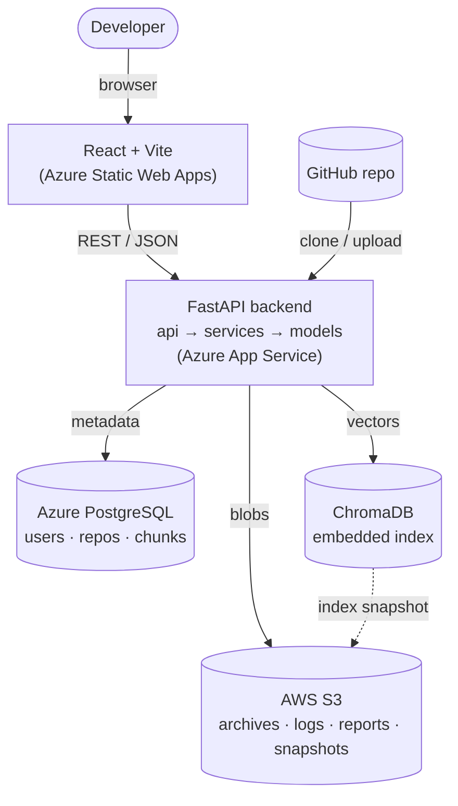

# CodeLens

> **AI-powered codebase search & bug localization.** Index any repository, ask
> questions in plain English — *"where is JWT auth implemented?"* — and localize
> bugs directly from stack traces, with an explanation for every result.

CodeLens parses a repository into files, classes, and functions, embeds those code
chunks into a vector space, and serves semantic search and bug localization over a
clean REST API and a modern React interface.

---

## Features

- **Semantic code search** — natural-language queries over a repository, ranked
  by meaning rather than keywords, with syntax-highlighted snippets and confidence
  scores.
- **Bug localization** — paste a stack trace or error log and get the most
  likely source files, ranked and explained.
- **Structural indexing** — files, directories, classes, functions, and imports
  extracted via tree-sitter for precise, language-aware chunking.
- **Repository insight** — statistics and an explorer for navigating an indexed
  codebase.
- **Authenticated, multi-repo** — JWT auth with per-user repositories.

## Tech stack

| Layer          | Choice                                                              |
| -------------- | ------------------------------------------------------------------- |
| Backend        | Python 3.12, FastAPI, SQLAlchemy, JWT                               |
| ML / Search    | sentence-transformers, ChromaDB (embedded), tree-sitter            |
| Database       | Azure Database for PostgreSQL (SQLite for local development)        |
| Object storage | AWS S3 — repository archives, logs, reports, exported indexes      |
| Frontend       | React, TypeScript, Vite, Tailwind CSS, shadcn/ui                   |
| Infrastructure | Docker, GitHub Actions, Azure App Service (API), Azure Static Web Apps (web) |

> **Multi-cloud:** compute, database, and web hosting run on **Azure**; durable
> object storage uses **AWS S3**. The vector index runs embedded inside the API
> and is snapshotted to S3, so no separate vector-DB server is required.

## Architecture



A layered backend keeps concerns separate: routes handle HTTP, services hold
business logic, models own persistence. Each store is used for what it does best:
relational metadata in **Azure PostgreSQL**, semantic vectors in an **embedded
ChromaDB** index, and durable blobs (repository archives, logs, reports, and
exported index snapshots) in **AWS S3**. Compute and web hosting run on Azure;
object storage on AWS — a deliberate multi-cloud split.

## Local development

Prerequisites: [`uv`](https://docs.astral.sh/uv/) (Python toolchain) and Node 20+.

```bash
# Backend
cd backend
uv sync                                  # create the virtualenv and install deps
uv run uvicorn app.main:app --reload     # API on http://localhost:8000
uv run pytest                            # run the test suite

# Interactive API docs → http://localhost:8000/docs
```

### With Docker (full stack)

```bash
docker compose up --build
# frontend → http://localhost:5173   |   API → http://localhost:8000/docs
```

Runs Postgres + backend + frontend together (mirrors production). First build is
slow — the backend image bundles the ML stack.

## Deployment

Free-tier friendly (Azure + AWS S3). See **[DEPLOYMENT.md](DEPLOYMENT.md)** for
step-by-step instructions and honest cost notes (the ML backend needs a host that
can run PyTorch — the guide covers the genuinely-free options).

## Continuous integration

Every push and PR runs [CI](.github/workflows/ci.yml): backend lint (ruff) + tests
(pytest) and a frontend type-check + build.

## Project layout

```
CodeLens/
├── backend/                FastAPI service
│   ├── app/
│   │   ├── api/routes/      HTTP endpoints
│   │   ├── core/            config, database, logging
│   │   ├── models/          SQLAlchemy models
│   │   ├── schemas/         Pydantic request/response schemas
│   │   └── services/        business logic (storage, ingestion, embeddings, search, …)
│   ├── tests/
│   └── Dockerfile
├── frontend/               React + Vite application (+ Dockerfile, nginx.conf)
├── .github/workflows/      CI (lint, test, build)
├── docker-compose.yml      local full stack
└── DEPLOYMENT.md           deploy guide (Azure + AWS S3)
```

## License

MIT
